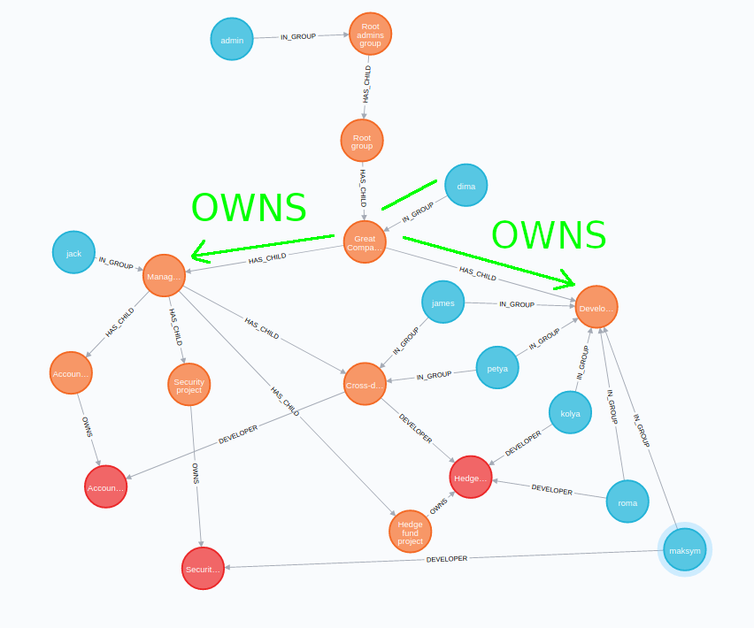

# About the project

Typically, authorization applications include some form of group and user relationships. In particular, lots of organizations do use ActiveDirectory to protect resources like code repositories, virtual machines, etc.
Such resource management, in essence, is backed by a user-group-resource relationship. This project aims to demonstrate the simplicity and cleanliness of the corporate authorization solution if it would be implemented using
graphs and Neo4j in particular. 


# Desktop tracker

Desktop tracker is [available at **releases page**](https://github.com/valb3r/time-tracker/releases/download/v0.2.0/time-tracker.zip),
**requires** Java 8+


# Tech stack:

1. Spring Boot 2 with reactive WebFlux REST endpoints and security.
1. Neo4j database with SDN-RX (endpoints) and OGM (reporting) access layers.
1. Spring Batch with metadata persistence on Neo4j
1. Angular / Angular material/flex for UI
1. Gradle as build system.
1. Dockerized deployment via docker-compose.


# Demo environment

Demo environment to play with project is [located here - https://demo.timetracker.tk](https://demo.timetracker.tk)

## Demo users

Admin user at https://demo.timetracker.tk has `admin/admin` credentials. You can see an organization tree with this user.
Typically, all other users have a password that is equal to the  username - you can try `petya/petya` for
example.


# Why graph database?

Group and users' owned resources are clear: 



Also, code that fetches those resources is simple too, exactly one query to read all owned groups:

```
MATCH (m:User)-[:IN_GROUP]->(g:Group)-[:HAS_CHILD*]->(r:Group) WHERE id(m) = $ownerId RETURN id(r) 
UNION MATCH (m:Group)-[:HAS_CHILD*]->(r:Group) WHERE id(m) = $ownerId RETURN id(r) 
UNION MATCH (m)-[role:MANAGER*]->(r:Group) WHERE id(m) = $ownerId AND (m:Group OR m:User) 
    AND NONE(
        dated in role WHERE (type(dated) IN ['MANAGER', 'DEVELOPER']) 
        AND (localdatetime() <= dated.from OR localdatetime() >= dated.to)
    )
RETURN id(r)
```

# UI / Application look

- [User/group management UI look](manage-and-record.gif)
- [Reporting UI look](report.gif)


# Features:

1. Complex user-group relations management including date based role validity 
(i.e. developer in project from 2019-01-01 to 2020-01-01).
1. Simple to use time card entry and modification.
1. Template-based report generation in xlsx format (using [jxls templates](http://jxls.sourceforge.net/)).
1. Reactive endpoints.


**Report templates can be found here:**
1. [By developer](worker/src/main/resources/by-developer.xlsx)
1. [By project](worker/src/main/resources/by-developer.xlsx)

# Architecture


# Build and run

Root project dir, execute these:

```sh
./gradlew clean buildImage
export TIMETRACKER_VERSION=`git rev-parse --verify --short HEAD`
docker-compose up 
# OR 'sudo -E docker-compose up' if you need sudo to run docker
```

Commands above spin up everything needed. UI will be at localhost:6500

# Run from IDE

1. Start the database using 
`docker run --rm -d --publish=7474:7474 --publish=7687:7687 --volume=$HOME/neo4j/data:/data -e NEO4J_AUTH=neo4j/docker neo4j/neo4j-experimental:4.0.0-rc01`

1. Start [administration module](administration/src/main/java/ua/timetracker/administration/AdministrationServer.java)
1. Start [time-tracking-server](time-tracking-server/src/main/java/ua/timetracker/timetrackingserver/TimeTrackingServer.java)
1. Start [worker](worker/src/main/java/ua/timetracker/reportgenerator/Worker.java) (only needed if you want reports)
1. Install and run UI:
    1. Install dependencies
        - cd [time-tracker-ui](time-tracker-ui)
        - npm install
    1. Install angular-cli: `npm install -g @angular/cli`
    1. Run UI: `ng serve --port 6500 --proxy-config proxy.conf.json`
1. Open http://localhost:6500 - there you can play with user `admin/admin`
     

# JWT token key generation

1. `openssl genrsa -out key_priv 2048`
2. `openssl rsa -in key_priv -pubout -outform PEM -out key.pem`
3. `openssl pkcs8 -topk8 -inform PEM -in key_priv -out key -nocrypt`
4. `rm -f key_priv`


# Stub data

To create stub data:
1. Ensure you have removed `neo-db` docker volume if it is not first start.
1. `docker-compose up`
1. run `administration/src/main/resources/init.sh`.

Important note - `init.sh` assumes that it is executed on clean database which was touched by administration 
application - that means clean neo4j started and administration app started but no users were added through UI.  
Test users all have same password as their login. I.e. `admin/admin`
